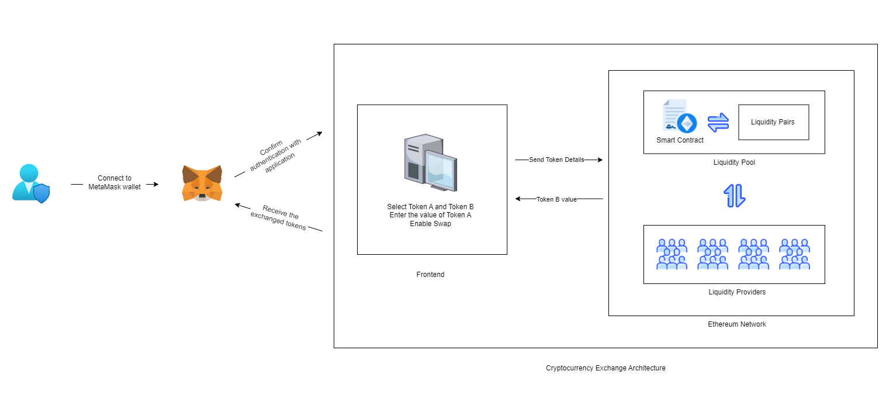
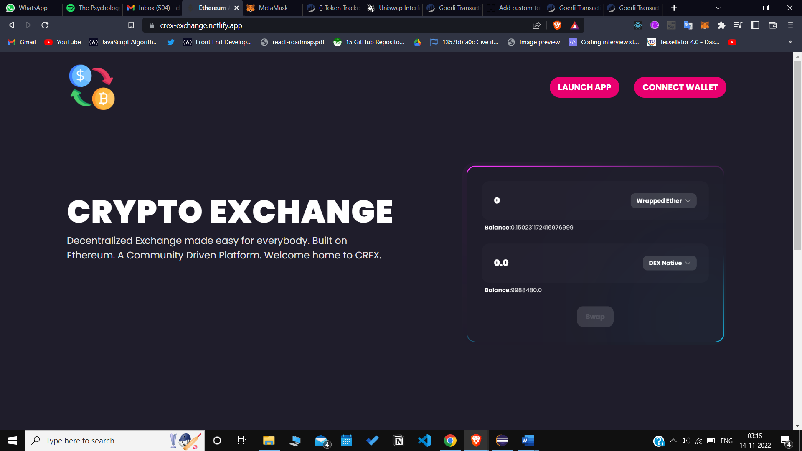
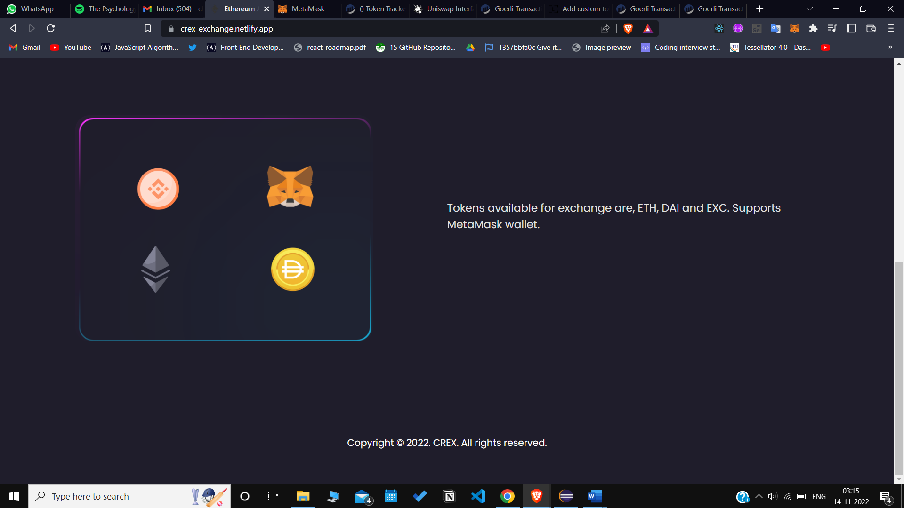
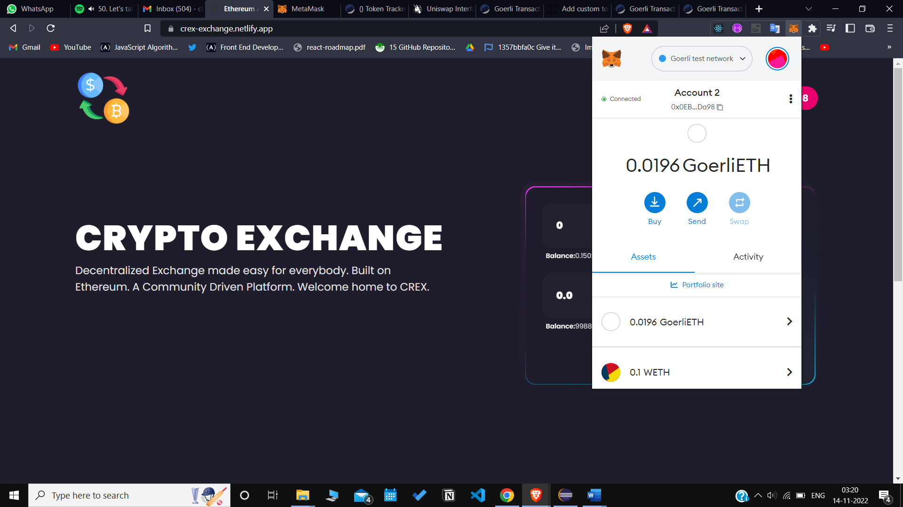
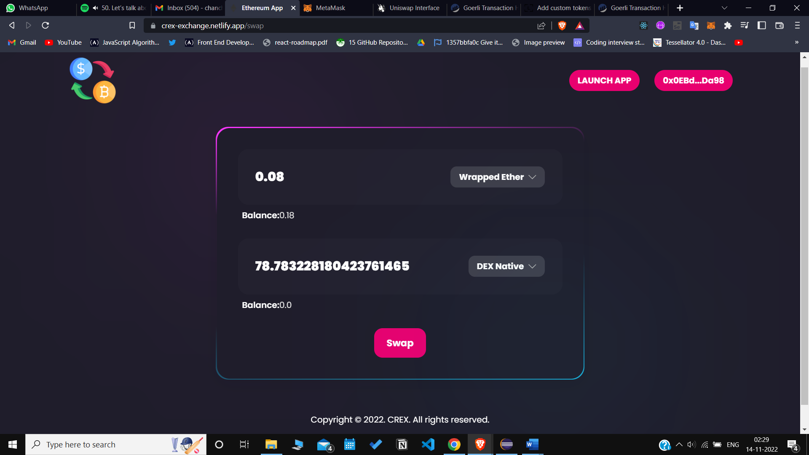
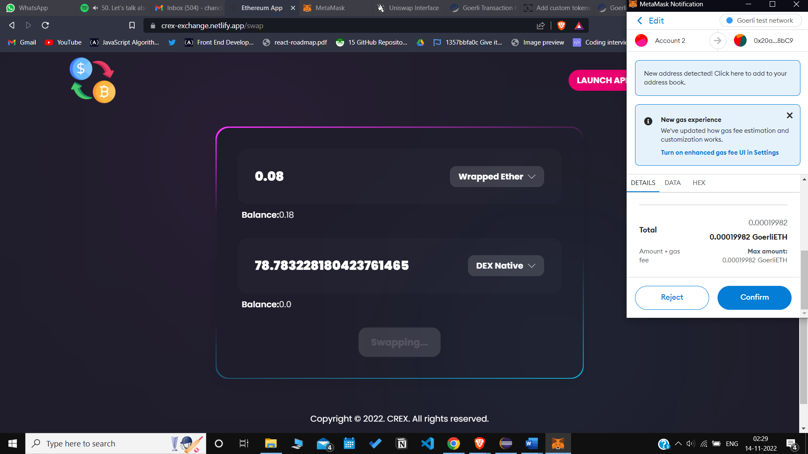
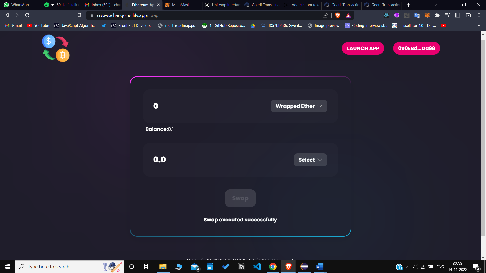
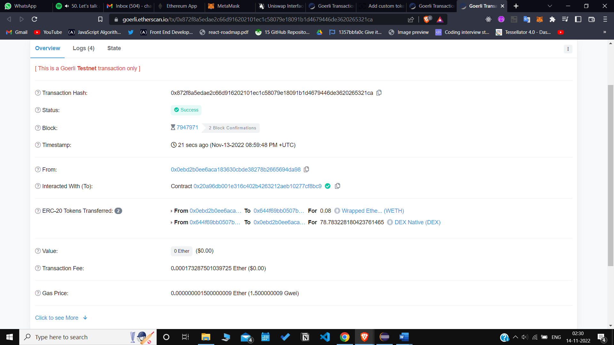
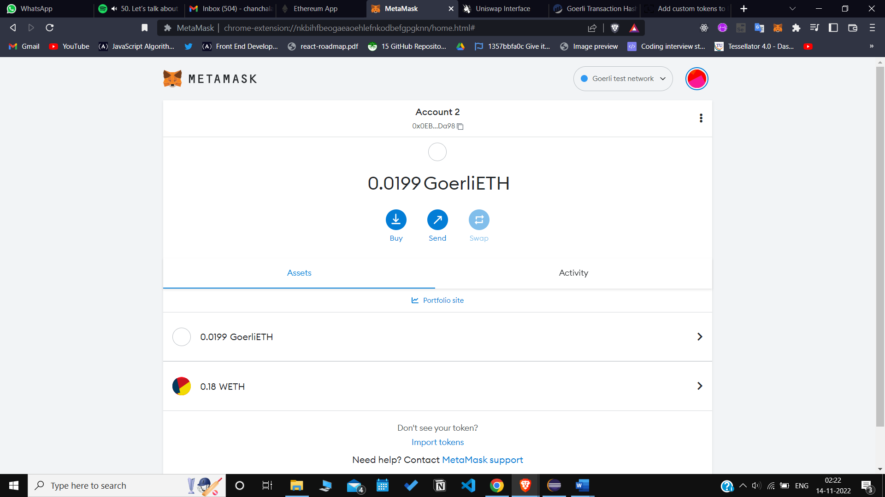
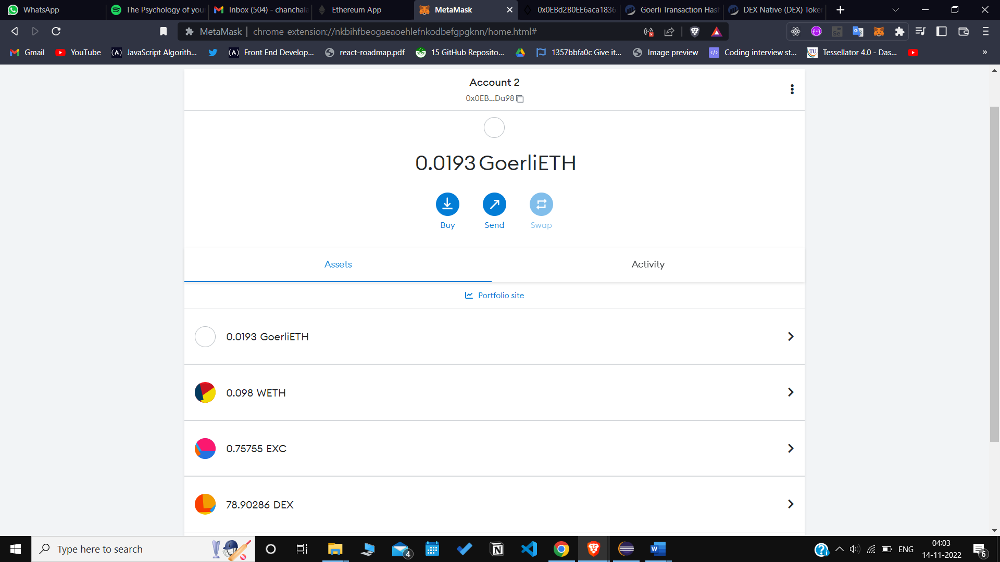

## Cryptocurrency Exchange Application

- To learn more about Decentralized systems and the concepts of Decentralized finance.
- To be able to understand the differences between Decentralized and Centralized systems. 
- To build and understand the working of a Decentralized Exchange application, its intergration with Cryptocurrency wallets, its functionality and performance on the Blockchain. 

## About the application
- A Decentralized Finance app which allows users to exchange one form of cryptocurrency into another with ease.
- This application falls under the category of Decentralized Exchange, a critical concept under the umbrella of Decentralized finance applications.
- This application is designed to be as user friendly as possible, with a simple interface that allows users to easily swap between tokens. There is no need to set up an account or login, and the process is designed to be as seamless as possible.

## Setting up the project locally

### Software Requirements 
- `npm and git`
- `cranq`
- `vs code ide`
- `Metamask Extension Installed`

### Procedure
1. Before getting started on with this project, make sure that you generate your smart contracts using `cranq`.
2. Store the details of `router address` achieved from the generation of smart contract
3. `git clone <project-url>`
4. `npm install`
5. `npm start`

## Working of the application
|  |
| :------------------------------------------------------: |
|        *Architecture Diagram of the Application*         |

## Note
Documentation for this project is available using the link below.
You can find detailed explanation of the application, UML diagrams and test case details in the documentation. 
- [Link to the documentation](./Documentation/defi-app-report.pdf)
- [Link to the presentation](./Documentation/defi-app-ppt.pptx)
- [Link to test-cases](./Documentation/test-cases.pdf)
- [Link to UML Diagrams](./Documentation/UML/UML.md)

## Screenshots of the application

|                                 |
| :----------------------------------------------------------------: |
|                           *Home Page 1*                            |
|                                 |
|                           *Home Page 2*                            |
|           |
|                      *Connect to the Wallet*                       |
|                           |
|                  *Select tokens to be exchanged*                   |
|          |
|                      *Confirm Token Exchange*                      |
|               |
|                    *Swap Executed Successfully*                    |
|  |
|     *Exchange Recorded on Ethereum Network's transaction Log*      |
|                  |
|                  *Token Balance before Exchange*                   |
|                      |
|                   *Token Balance after Exchange*                   |

